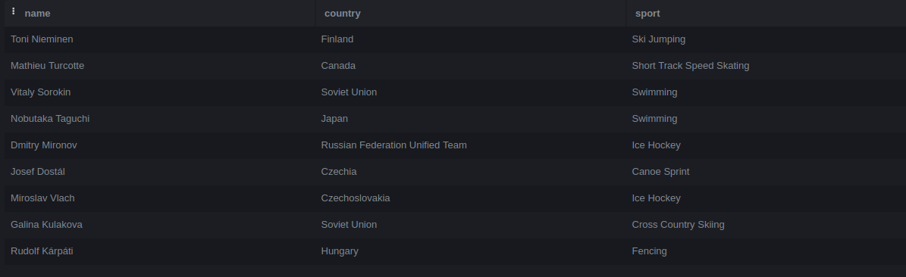

# Gabarito Laboratório 3

Segue gabarito dos exercícios propostos para entrega no [Laboratório 3](../LAB03/enunciado.md).

## Exercício 1

### Pergunta


Escreva uma consulta que liste o nome do atleta, o país e o esporte para os atletas que ganharam medalhas. Use a tabela athlete e a tabela result.


### Resposta
Nesse exercício, a consulta 1 consegue trazer a resposta esperada (isso tem que ver com o uso de sqliteonline que salva NULL como ""), no caso de dados faltantes, são geralmente expressos como dados NULL (consulta 2).
### Consulta 1
```sql
SELECT a.name, a.country, r.sport
FROM athlete a
INNER JOIN results r ON a.athlete_id = r.athlete_id
WHERE r.medal !='';
```

Figura 1: Saidá esperada.

### Consulta 2
```sql
SELECT a.name, a.country, r.sport
FROM athlete a
INNER JOIN results r ON a.athlete_id = r.athlete_id
WHERE r.medal IS NOT NULL;
```


### Nota atribuída no exercício

- 10, O estudante percebeu que os dados NULL foram salvados como '' ou usou de IS NOT NULL
    - WHERE validos:
        +  ```sql r.medal IS NOT NULL ``` 
        +  ```sql r.medal in ('Gold', 'Silver', 'Bronze') ``` 
        +  ```sql r.medal !='' ```
        + ```sql r.medal NOT LIKE ''```
    - JOIN validos só usando os *id's*
        + INNER JOIN
        + JOIN
- 5, Resposta esperada com inclusão de colunas extras das pedidas na consulta, consultas parciais mesma saída com elementos incorretos (Exemplo: uso de tipo Join incorreto)

- 0, caso contrário.


## Exercício 5

### Pergunta


Escreva uma consulta que retorne o total de medalhas de ouro conquistadas por cada país.

### Resposta
```sql
SELECT country, SUM(gold)
FROM medals
GROUP BY country;
```
### Pergunta

### Nota atribuída no exercício
+ 10, O estudante realizou o agrupamento por países. Devido à pergunta não especificar restrições de tabela, se considerará consulta só nas tabelas medals e results.

+ 5, Consulta correta com colunas extras das pedidas.

+ 0, Caso contrario.
## Exercício 8


### Pergunta
Escreva uma consulta que agrupe os atletas pelo país e mostre a média de altura, considerando apenas os países que têm mais de 10 atletas.
### Resposta
```sql
SELECT country, AVG(height)
FROM athlete
GROUP BY country
HAVING COUNT(*) > 10;
```

### Nota atribuída no exercício
+ 10, Consultas corretas parecidas com a resposta e consultas na mesma tabela com mesmo resultado.

+ 0, caso contrario.
## Exercício 16

### Pergunta


Escreva uma consulta que agrupe os países pela quantidade total de medalhas e categorize o país como "Alta Performance" se o total de medalhas for maior que 50, ou "Baixa Performance" caso contrário.

### Resposta
```sql
SELECT country,
       SUM(total) AS total_medals,
       CASE WHEN SUM(total) > 50 THEN 'Alta Performance'
            ELSE 'Baixa Performance' END AS performance
FROM medals
GROUP BY country;
```

### Nota atribuída no exercício
10, Consulta sobre tabela medals e uso de CASE aplicado corretamente. 
0, caso contrario.
## Exercício 17

### Pergunta
Explique o resultado da seguinte consulta:
```sql
SELECT a.name, r.event
FROM athlete a
LEFT JOIN results r ON a.athlete_id = r.athlete_id;
```
### Resposta
A consulta retorna o nome de todos os atletas e os eventos em que participaram. Atletas que não participaram de eventos terão NULL na coluna de evento.

### Nota atribuída no exercício
+ 10, A resposta que explica adequadamente o uso de LEFT JOIN falando que o NULL será devolvido em alguns casos.
+ 0, caso contrario
## Exercício 19

### Pergunta
Analise a consulta e explique o que ela faz:
```sql
SELECT m.country, SUM(m.gold) AS total_ouro
FROM medals m
GROUP BY m.country;
```
### Resposta
A consulta retorna o total de medalhas de ouro que cada país ganhou, agrupando pelo país.

### Nota atribuída no exercício
+ 10, A resposta que explica adequadamente o uso de comando GROUP e SUM
+ 0, caso contrario

## Exercício 22

### Pergunta

Analise a consulta a seguir:
```sql
SELECT r.sport, SUM(CASE WHEN r.medal = 'Gold' THEN 1 ELSE 0 END) AS ouro,
             SUM(CASE WHEN r.medal = 'Silver' THEN 1 ELSE 0 END) AS prata
FROM results r
GROUP BY r.sport;
```
### Resposta
A consulta retorna o número total de medalhas de ouro e prata ganhas em cada esporte.

### Nota atribuída no exercício
+ 10, A resposta que explica adequadamente o uso dos comandos CASE e GROUP.
+ 0, caso contrario

## Exercício 27

### Pergunta

Corrija o erro nesta consulta:
```sql
SELECT country, SUM(gold)
FROM medals
GROUP BY country;
```
### Resposta
```sql
SELECT country, SUM(gold) AS total_gold
FROM medals
GROUP BY country;
```
Embora a consulta está sintaticamente correta.


### Nota atribuída no exercício
10, para quem sinalizou que a pergunta não tem erro ou adicionou o AS.
0, outros casos

## Exercício 28

### Pergunta
Corrija a seguinte consulta para calcular a altura média dos atletas que têm resultados:
```sql
SELECT AVG(height)
FROM athlete;
```
### Resposta
**Erro:** Não há restrição para considerar apenas atletas com resultados.
**Consulta corrigida:**
```sql
SELECT AVG(a.height)
FROM athlete a
INNER JOIN results r ON a.athlete_id = r.athlete_id;
```

### Nota atribuída no exercício
+ 10, Identificar o uso de um JOIN or INNER JOIN
+ 5, Usou do JOIN incorreto ou só sinalizar o erro sem corrigir.
+ 0, outros casos

## Exercício 32

### Pergunta

Corrija o erro na consulta abaixo:
```sql
SELECT r.edition, COUNT(a.athlete_id) AS total_atletas
FROM athlete a
JOIN results r ON a.athlete_id = r.athlete_id
GROUP BY r.edition
ORDER BY a.name ASC;
```
### Resposta
**Erro:** A coluna a.name não faz parte do SELECT e não pode ser usada no ORDER BY.

```sql
SELECT r.edition, COUNT(a.athlete_id) AS total_atletas
FROM athlete a
JOIN results r ON a.athlete_id = r.athlete_id
GROUP BY r.edition
ORDER BY total_atletas DESC;

```
### Nota atribuída no exercício
+ 10, Adicionou um ORDER BY adequado nas colunas selecionadas
+ 5, Só sinalizar o erro sem corrigir
+ 0, Outros casos
## Composição da nota final

Média aritmética entre notas obtidas nos exercícios 1, 5, 8, 16, 17, 19, 22, 27, 28, 32.
