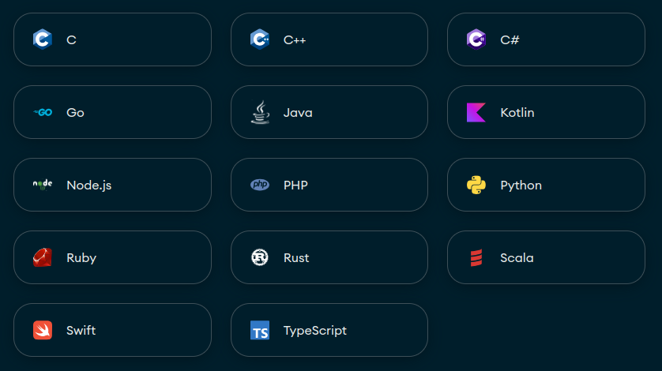
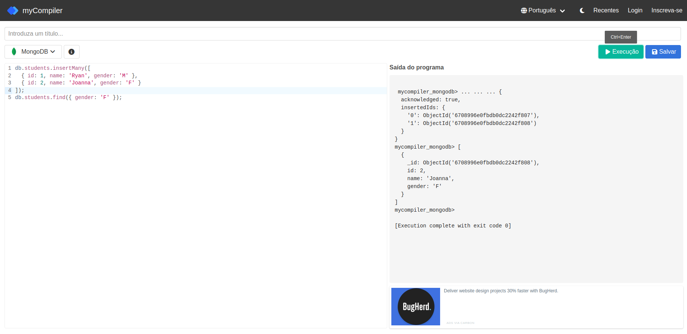

# Laboratório 4
## 1. Objetivos

- Executar operações de manipulação de dados no MongoDB com comandos ```insertMany()```, ```find()```, ```sort()``` e ```limit()```.

## 2. Descrição

O banco de dados relacional do COB (Comitê Olímpico do Brasil) está escalando muito desde a edição dos Jogos Olímpicos de Paris de 2024, quando o Brasil atraiu a atenção de diversos países ao ter mais mulheres no pódio do que homens - de 20 medalhas, 12 foram conquistadas por mulheres, 7 por homens e 1 por uma competição mista. 

O COB decidiu, então, testar o uso de um banco de dados NoSQL para armazenar os dados de seus atletas. Você sugeriu o MongoDB por ele ser o banco NoSQL mais usado no mundo em 2024. Agora, você terá de fazer alguns testes preliminares com o MongoDB para checar sua capacidade de armazenar e recuperar dados.

### 2.1 Acessar o MongoDB

Usualmente, você precisaria criar uma conta no [site oficial do MongoDB](https://www.mongodb.com/) para ter acesso a um console online para gerenciamento de bancos de dados NoSQL. Também seria preciso criar uma aplicação com uma das linguagens listadas na Imagem 1 e instalar alguma biblioteca suportada pelo MongoDB para estabelecer uma conexão com o banco NoSQL e executar operações de manipulação de dados.



*Imagem 1: Bibliotecas oficialmente suportadas pelo MongoDB (Fonte: https://www.mongodb.com/docs/drivers/)*

Como você só precisa fazer alguns testes preliminares com o MongoDB, vamos trabalhar com ele através do site [myCompiler](https://www.mycompiler.io/pt/new/mongodb), que permite a execução de comandos do MongoDB em um console online.



*Imagem 2: Interface do site myCompiler*

No myCompiler, você poderá:
- escrever comandos do MongoDB no editor de texto à esquerda da página;
- executá-los clicando no botão "Execução" que aparece no canto superior direito da tela;
- conferir os resultados no console à direita da página.

Infelizmente, o myCompiler não persiste os dados inseridos entre diferentes execuções de comando. Isso significa que **você sempre deve manter o comando necessário para inserir dados numa collection no começo do editor de texto do myCompiler** para que seja possível operar consultas nesses dados. Caso você tente executar somente um comando de consulta, por mais que você tenha executado o comando de inserção de dados anteriormente, você verá o erro a seguir no console com a saída do programa:

```shell
 mycompiler_mongodb> 
mycompiler_mongodb> 
mycompiler_mongodb> 
mycompiler_mongodb> 
mycompiler_mongodb> 
mycompiler_mongodb> 

[Execution complete with exit code 0]
```

*Resumindo*

Exemplo de programa que funciona:
```sql
db.students.insertMany([
  { id: 1, name: 'Ryan', gender: 'M' },
  { id: 2, name: 'Joanna', gender: 'F' }
]);
db.students.find({ gender: 'M' });
```

Exemplo de programa que não funciona:
```sql
db.students.find({ gender: 'M' });
```

### 2.2 Criar uma collection

Crie uma collection chamada ```atletas``` para armazenar os seguintes documentos contendo informações sobre as mulheres que receberam medalhas individuais nos Jogos Olímpicos de Paris de 2024:

```
{ nome: 'Beatriz Souza', ano_nascimento: 1998, esporte: 'Judô', conquistas: [{ ano: 2024, medalhas: ['Ouro'] }] }

{ nome: 'Rebeca Andrade', ano_nascimento: 1999, esporte: 'Ginástica Artística', conquistas: [{ ano: 2024, medalhas: ['Ouro', 'Prata', 'Prata', 'Bronze'] }, { ano: 2020, medalhas: ['Ouro', 'Prata'] }] }

{ nome: 'Ana Patrícia Ramos', ano_nascimento: 1997, esporte: 'Vôlei de Praia', conquistas: [{ ano: 2024, medalhas: ['Ouro'] }] }

{ nome: 'Tatiana Weston-Webb', ano_nascimento: 1996, esporte: 'Surfe', conquistas: [{ ano: 2024, medalhas: ['Prata'] }] }

{ nome: 'Larissa Pimenta', ano_nascimento: 1999, esporte: 'Judô', conquistas: [{ ano: 2024, medalhas: ['Bronze'] }] }

{ nome: 'Rayssa Leal', ano_nascimento: 2008, esporte: 'Skate Street', conquistas: [{ ano: 2024, medalhas: ['Bronze'] }, { ano: 2020, medalhas: ['Prata'] }] }

{ nome: 'Bia Ferreira', ano_nascimento: 1992, esporte: 'Boxe', conquistas: [{ ano: 2024, medalhas: ['Bronze'] }] }
```

### 2.3 Consultar documentos

Crie consultas em MongoDB para buscar:

1. Todos os medalhistas ordenados por ordem alfabética de nome

2. Todos os medalhistas ordenados por idade crescente

3. Medalhistas de Judô

4. Medalhistas de Vôlei de Praia ou Surfe

5. Medalhistas com mais de 25 anos ou mais de 1 conquista em olimpíadas

6. Medalhistas em mais de uma edição dos jogos olímpicos (*Dica: leia [documentação do MongoDB sobre operador size](https://www.mongodb.com/docs/manual/reference/operator/query/size/)*)

7. Multi-medalhistas em alguma edição dos jogos olímpicos (*Dica: leia [documentação do MongoDB sobre operador size](https://www.mongodb.com/docs/manual/reference/operator/query/size/)*)

8. Nome e esporte dos medalhistas das edições dos Jogos Olímpicos de 2020

9. Nome dos medalhistas de ouro na edição de 2024 dos Jogos Olímpicos

10. Ano de nascimento dos medalhistas de bronze cujo nome é iniciado em R

11. Medalhistas que não tem nenhuma medalha de ouro (*Dica: leia [documentação do MongoDB sobre operador nin](https://www.mongodb.com/docs/manual/reference/operator/query/nin/)*)

12. Medalhistas de ouro ou prata

13. Medalhistas de prata com idade entre 20 e 25 anos

14. Medalhista mais velho a receber medalha de ouro nas olímpiadas

15. Medalhistas que conquistaram ao menos 2 medalhas em um único ano

16. Medalhistas que tenham conquistado ao menos uma medalha de ouro e uma medalha de prata em um único ano

### 2.4 Analisar consultas

Explique, em alto nível, o resultado das seguintes consultas:

17.
```sql
db.atletas.find({
    'conquistas.medalhas': "Prata"
})
```

18.
```sql
db.atletas.find({
    'conquistas.medalhas': { $all: ["Ouro", "Prata"] }
})
```

19.
```sql
db.atletas.find({
    'conquistas.medalhas': ["Ouro", "Prata"]
})
```

20.
```sql
db.atletas.find({
    conquistas: { $size: 1 }
}).sort({
    ano_nascimento: -1
}).limit(3)
```

### 2.5 Corrigir consultas

Aponte o erro das seguinte consultas:

21.
```sql
db.atletas.find()
```

22.
```sql
db.atletas.find({
    ano_nascimento: { $gt: "1995" },
    ano_nascimento: { $lt: "2000" }
})
```

23.
```sql
db.atletas.find({
  $and: [{ ano_nascimento: { $gte: 1999 }, conquistas: { $size: ${ gt: 1 } } }]
})
```

24.
```sql
db.atletas.find({
  esporte: { $in: ["Judô", "Ginástica Artística", "Skate Street"] },
  $or: { ano_nascimento: { $gte: 1999 }, conquistas: { $size: ${ gt: 1 } } }
})
```

25.
```sql
db.atletas.find({
  conquistas: {
    medalhas: {
        $elemMatch: { $in: ["Ouro", "Prata"] }
    }
  }
})
```

## 3. Tarefas

- Consultar documentos (Exercícios 1-16);
- Analisar consultas (Exercícios 17-20);
- Corrigir consultas (Exercícios 21-25).

## 4. Submissão

Este laboratório pode ser feito em **dupla** ou **indiviual**. Submeta arquivos .pdf, .docx ou .txt no Google Classroom com a resolução dos exercícios:

- Exercícios 9 e 14 (Seção 2.3);
- Exercícios 17, 18, 19 e 20 (Seção 2.4);
- Exercícios 22 e 25 (Seção 2.5).

**Data de entrega**: Dia 18/10/2024 até às 23h59.

## 5. Critérios de Avaliação

Serão utilizados os seguintes critérios de avaliação:

- Corretude sintática e semântica das consultas escritas;
- Capacidade de identificar resultados e erros de sintaxe em consultas em MongoDB.
