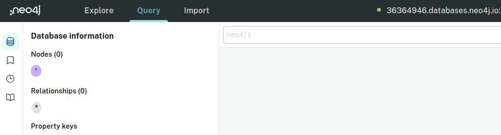
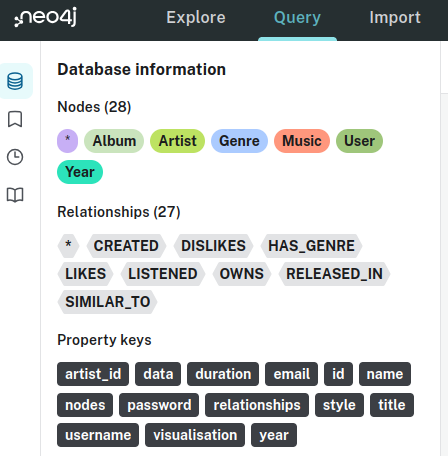

# Laboratório 5
## 1. Objetivos

- Usar banco de dados orientados a grafos.
- Aprender a linguagem de consulta Cypher.


## 2. Descrição

O banco do COB (Comitê Olímpico do Brasil) teve grande sucesso durante os Jogos Olímpicos de Paris 2024. Sua sugestão do MongoDB foi um êxito, e os testes preliminares deixaram o COB satisfeito. Parabéns pelo excelente trabalho!

Agora, você foi contratado para um novo projeto: criar um banco de dados orientado a grafos utilizando o **Neo4j**, focado em um sistema de músicas similar ao **Spotify**. Você sugeriu o desenvolvimento de um modelo que inclua artistas, álbuns, músicas e usuários, além de realizar testes para garantir a consistência e a integridade dos dados.

### 2.1 Acessar o Neo4j
Para realizar essa tarefa voce vai precisar criar uma conta no site [oficial de Neo4j](https://console.neo4j.io/?iss=https%3A%2F%2Flogin.neo4j.com%2F) (Imagem 1) para acessar o console online para gerenciamento de bancos de dados de grafos.


*Imagem 1: Criação da conta de Neo4j (Fonte:https://neo4j.com/)*
Depois de criar a conta neo4j criará uma instancia onde o banco será armazeado. 


Como você só precisa fazer alguns testes preliminares com Neo4j voce utilizará a consola para executar as consultas na linguagem Cypher.



*Imagem 2: Interface do site de Neo4J*

No Neo4j, você poderá:
- Escrever comandos do Cypher no console  da página;
- Executá-los clicando no botão "Execução" que aparece no canto superior direito da tela;
- Conferir os resultados no console.
- Explorar as entidades e relações do grafo.


### 2.2 Criar um grafo inicial
Como a instância de Neo4j está vazia, você precisará criar um grafo inicial. Para isso, você poderá usar o código de baixo copiando e colando na consola.


```cypher
// Criando artistas
CREATE (taylor:Artist {artist_id: 1, name: "Taylor Swift"})
CREATE (adele:Artist {artist_id: 2, name: "Adele"})
CREATE (ed:Artist {artist_id: 3, name: "Ed Sheeran"})
CREATE (beyonce:Artist {artist_id: 4, name: "Beyoncé"})
CREATE (bruno:Artist {artist_id: 5, name: "Bruno Mars"})

// Criando álbuns
CREATE (album_taylor:Album {name: "1989"})
CREATE (album_adele:Album {name: "25"})
CREATE (album_ed:Album {name: "Divide"})
CREATE (album_beyonce:Album {name: "Lemonade"})
CREATE (album_bruno:Album {name: "Doo-Wops & Hooligans"})

// Criando músicas
CREATE (blank_space:Music {title: "Blank Space", duration: 231})
CREATE (hello:Music {title: "Hello", duration: 295})
CREATE (shape_of_you:Music {title: "Shape of You", duration: 240})
CREATE (formation:Music {title: "Formation", duration: 214})
CREATE (just_the_way:Music {title: "Just the Way You Are", duration: 220})

// Criando gêneros
CREATE (pop:Genre {name: "Pop"})
CREATE (soul:Genre {name: "Soul"})
CREATE (rnb:Genre {name: "R&B"})
CREATE (hiphop:Genre {name: "Hip-Hop"})

// Criando usuários
CREATE (alice:User {email: "alice@example.com", username: "alice_music", password: "alice123"})
CREATE (bob:User {email: "bob@example.com", username: "bob_loves_adele", password: "bob456"})

// Criando relacionamentos entre artistas e álbuns
CREATE (taylor)-[:CREATED]->(album_taylor)
CREATE (adele)-[:CREATED]->(album_adele)
CREATE (ed)-[:CREATED]->(album_ed)
CREATE (beyonce)-[:CREATED]->(album_beyonce)
CREATE (bruno)-[:CREATED]->(album_bruno)

// Criando relacionamentos entre álbuns e músicas
CREATE (album_taylor)-[:OWNS]->(blank_space)
CREATE (album_adele)-[:OWNS]->(hello)
CREATE (album_ed)-[:OWNS]->(shape_of_you)
CREATE (album_beyonce)-[:OWNS]->(formation)
CREATE (album_bruno)-[:OWNS]->(just_the_way)

// Criando relacionamentos entre músicas e gêneros
CREATE (blank_space)-[:HAS_GENRE]->(pop)
CREATE (hello)-[:HAS_GENRE]->(soul)
CREATE (shape_of_you)-[:HAS_GENRE]->(pop)
CREATE (formation)-[:HAS_GENRE]->(rnb)
CREATE (just_the_way)-[:HAS_GENRE]->(pop)

// Relacionando usuários com gêneros e músicas
CREATE (alice)-[:LIKES]->(pop)
CREATE (alice)-[:LISTENED]->(blank_space)
CREATE (bob)-[:DISLIKES]->(pop)
CREATE (bob)-[:LISTENED]->(hello)

// Relacionando artistas semelhantes
CREATE (taylor)-[:SIMILAR_TO]->(ed)
CREATE (beyonce)-[:SIMILAR_TO]->(bruno)

// Relacionando músicas com o ano de lançamento
CREATE (year_2014:Year {year: 2014})
CREATE (year_2015:Year {year: 2015})
CREATE (year_2017:Year {year: 2017})
CREATE (year_2016:Year {year: 2016})
CREATE (year_2010:Year {year: 2010})

CREATE (blank_space)-[:RELEASED_IN]->(year_2014)
CREATE (hello)-[:RELEASED_IN]->(year_2015)
CREATE (shape_of_you)-[:RELEASED_IN]->(year_2017)
CREATE (formation)-[:RELEASED_IN]->(year_2016)
CREATE (just_the_way)-[:RELEASED_IN]->(year_2010)

```
Após criar o grafo, você deverá ver informações atualizadas no canto superior esquerdo da tela (Imagem 3).

Imagem 3: Nós e relações no grafo criado.
### 2.3 Consultar documentos

Crie consultas em Cypher para buscar (Se a relação não existir, você deve criar-lá):

1. Crie um novo usuário chamado "Carlos" com o e-mail carlos@example.com e uma senha carlos123. Conecte esse usuário a um gênero musical "Rock", que ele gosta.

2. Encontre todas as músicas com duração superior a 240 segundos (4 minutos) e retorne o título da música e seu respectivo album.

3. Escreva uma consulta para retornar todas as músicas do álbum criado por Taylor Swift.

4. Retorne os nomes de todos os usuários cujos nomes de usuário começam com a letra "A".

5. Escreva uma consulta para contar quantos usuários ouviram músicas do gênero "Pop".


6. Encontre o total de músicas de cada gênero no banco de dados e ordene o resultado de forma decrescente com base na quantidade de músicas por gênero.

7. Retorne todos os álbuns ordenados pelo nome, em ordem crescente.

8. Encontre todos as músicas lançadas no ano de 2016 ou posterior e retorne o nome da musíca (title) e o ano de lançamento.


9. Escreva uma consulta para retornar todas as músicas lançadas em 2017.

10. Retorne o total de álbuns criados por cada artista.


### 2.4 Analisar consultas

Explique, em alto nível, o resultado das seguintes consultas:

11.

```cypher
MATCH (artist:Artist)-[:CREATED]->(album:Album)
RETURN artist.name, album.name
```
12.
```cypher
MATCH (user:User)-[:LISTENED]->(music:Music)-[:HAS_GENRE]->(genre:Genre)
RETURN user.username, genre.name
```

13.
```cypher
MATCH (artist:Artist)
WHERE artist.name STARTS WITH 'T'
RETURN artist.name
```

14.
```cypher
MATCH (music:Music)-[:HAS_GENRE]->(genre:Genre)
RETURN genre.name, COUNT(music) AS total_musics

```
15.
```cypher
MATCH (user:User)-[:LISTENED]->(music:Music)
RETURN user.username, COUNT(music) AS total_musics_listened
```
16.
```cypher
MATCH (music:Music)-[:RELEASED_IN]->(year:Year)
WHERE year.year >= 2016
RETURN music.title, year.year
```
17.
```cypher
MATCH (artist:Artist)-[:CREATED]->(album:Album)-[:OWNS]->(music:Music)
WHERE music.duration > 240
RETURN artist.name, music.title
```

18. 
```cypher
MATCH (user:User)-[:LIKES]->(genre:Genre)<-[:HAS_GENRE]-(music:Music)
RETURN genre.name, COUNT(DISTINCT user) AS user_count
```

### 2.5 Corrigir consultas

Aponte o erro das seguinte consultas:

19.
```cypher
MATCH (artist:Artist)-[:MADE]->(album:Album)
RETURN artist.name, album.name
```
20.
```cypher
MATCH (user:User)-[:LISTENED]->(music:Music)-[:RELEASED_IN]->(year:Year {year: 2014})
RETURN user.username
```

21.
```cypher
MATCH (music:Music)
WHERE duration > 250
RETURN music.title
```

22.
```cypher
MATCH (artist:Artist)-[:OWNS]->(music:Music)
RETURN artist.name, music.title
```

23.
```cypher
MATCH (user:User)-[:LIKES]->(genre:Genre)-[:LISTENED]->(music:Music)
RETURN user.username, music.title
```

24.
```cypher
MATCH (user:User)-[:DISLIKES]->(music:Music)
RETURN user.username, music.title
```
25.
```cypher
MATCH (artist:Artist {name: "Taylor Swift"})-[:SIMILAR_TO]-(similar_artist)-[:CREATED]->(music:Music)
RETURN music.title
```
26.
```cypher
MATCH (artist:Artist)-[:CREATED]->(album:Album)-[:OWNS]->(music:Music)
RETURN artist.name, COUNT(music) AS total_musics
ORDER BY music.duration DESC

```
## 3. Tarefas

- Consultar documentos (Exercícios 1-10);
- Analisar consultas (Exercícios 11-18);
- Corrigir consultas (Exercícios 18-26).

## 4. Submissão

Este laboratório pode ser feito em **dupla** ou **indiviual**. Submeta arquivos .pdf, .docx ou .txt no Google Classroom com a resolução dos exercícios:

- Exercícios 5, 6, 8, 10 (Seção 2.3);
- Exercícios 12, 15 (Seção 2.4);
- Exercícios 24 e 25 (Seção 2.5).

**Data de entrega**: Dia 25/10/2024 até às 23h59.

## 5. Critérios de Avaliação

Serão utilizados os seguintes critérios de avaliação:

- Corretude sintática e semântica das consultas escritas;
- Capacidade de identificar resultados e erros de sintaxe em consultas em Cypher.
